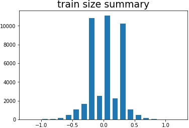

# **Behavioral Cloning** 

---

**Behavioral Cloning Project**

The goals / steps of this project are the following:
* Use the simulator to collect data of good driving behavior
* Build, a convolution neural network in Keras that predicts steering angles from images
* Train and validate the model with a training and validation set
* Test that the model successfully drives around track one without leaving the road
* Summarize the results with a written report


## Rubric Points
### Here I will consider the [rubric points](https://review.udacity.com/#!/rubrics/432/view) individually and describe how I addressed each point in my implementation.  

---
### Files Submitted & Code Quality

#### 1. Submission includes all required files and can be used to run the simulator in autonomous mode

My project includes the following files:
* model.ipynb containing the script to create and train the model
* drive.py for driving the car in autonomous mode
* model.h5 containing a trained convolution neural network 
* writeup_report.md summarizing the results
* proprocessing_test.ipynb for some demonstration about image proprocessimg
* output_video.mp4 show the model drive the car on track 1

#### 2. Submission includes functional code
Using the Udacity provided simulator and my drive.py file, the car can be driven autonomously around the track by executing 
```sh
python drive.py model.h5
```

#### 3. Submission code is usable and readable

The model.ipynb file contains the code for training and saving the convolution neural network. The file shows the pipeline I used for training and validating the model, and it contains comments to explain how the code works.  
readFromDir(): get all images from IMG dir on windows or linux  
transform_image(): transform an image in x or y direction randomly  
flip_image(): Horizontally Flip an image  
bright_image(): adjust brightness of images randomly  
Above 3 methods I used in generator_train() to augment data, in order to avoid overfitting.  
preprocess_image(): Select interested region, resize, and normalization  
generator_train() and generator_valid() are used to generate augmented data in time, but not save to disk.  

### Model Architecture and Training Strategy

#### 1. An appropriate model architecture has been employed

My model is derived from project 2, which is [tzyhpcom/CNN-Traffic-Sign-Classifier](https://github.com/tzyhpcom/CNN-Traffic-Sign-Classifier). The architecture is as follows.  

| Layer         	|     Description	        		| 
|:---------------------:|:---------------------------------------------:| 
| Input         	| 64x64x3 gray image   				| 
| Convolution 1x1     	| 1x1 stride, valid padding, outputs 64x64x16 	|
| ELU			|						|
| Max pooling	      	| 2x2 stride,  outputs 32x32x16 		|
| Convolution 5x5	| 1x1 stride, valid padding, outputs 28x28x32   |
| ELU			|						|
| Max pooling	      	| 2x2 stride,  outputs 14x14x32 		|
| Convolution 1x1     	| 1x1 stride, valid padding, outputs 14x14x32 	|
| ELU			|						|
| Convolution 5x5	| 1x1 stride, valid padding, outputs 10x10x64   |
| ELU			|						|
| Max pooling	      	| 2x2 stride,  outputs 5x5x64 		        |
| Convolution 1x1     	| 1x1 stride, valid padding, outputs 5x5x64 	|
| ELU			|						|
| Flatten	| conv4+conv5, outputs 3200       		|
| Dropout		| keep_prob 0.5					|
| Fully connected	| conv4+conv5, outputs 128       		|
| ELU   		|         					|
| Dropout		| keep_prob 0.5					|
| Value        	| outputs 1     				|  

#### 2. Attempts to reduce overfitting in the model

The model contains maxpooling layers, dropout layers and l2 norm in order to reduce overfitting.

The model was trained and validated on different data sets to ensure that the model was not overfitting. I gathered 33880 images for training and 8471 for validation. And use transform_image() flip_image() bright_image() to generalize my model.  


#### 3. Model parameter tuning

The model used an adam optimizer, so the learning rate was not tuned manually.  
Adam(lr=1e-4, beta_1=0.9, beta_2=0.999, epsilon=1e-08, decay=0.0)  

#### 4. Appropriate training data

Training data was chosen to keep the vehicle driving on the road. I used a combination of center lane driving, recovering from the left and right sides of the road. I add angle shift correction 0.25 to left and right images. In each epoch, generator_train() will get all train images and augment them with transform_image() flip_image() bright_image(). The original train dataset is shown below.  
  

### Model Architecture and Training Strategy

#### 1. Solution Design Approach

The overall strategy for deriving a model architecture was to end-to-end deep learning, which can map an image form car camera to an angel.  

My first step was to use a convolution neural network model similar to the project 2. I thought this model might be appropriate because I can get pretty good classification accuracy from P2, which means my model can get good feature extraction from an image. So it could be transfered to slove this problem.  

In order to gauge how well the model was working, I split my image and steering angle data into a training and validation set. After 10 epoches, the MSE of train data is stable and hardly reduced. And validation MSE is lowed. So the model is well trained. The MSE loss is shown below.  
  

The final step was to run the simulator to see how well the car was driving around track one. The vehicle is able to drive autonomously around the track without leaving the road.

#### 2. Final Model Architecture

The final model architecture is shown above.

#### 3. Creation of the Training Set & Training Process

To capture good driving behavior, I recorded three laps of center lane driving, one lap of recovery driving from the sides, one lap focusing on driving smoothly around curves, one lap driving backward, all on track 1.

To augment the data sat, I also flipped images and angles thinking that this would simulate driving backward, transform an image in x or y direction randomly and add angle shift correction to simulate recovery behavior, adjust brightness of images randomly to simulate drive in shadow, which is shown in proprocessing_test.ipynb.

I finally randomly shuffled the data set and put 20% of the data into a validation set. 

I used this training data for training the model. The validation set helped determine if the model was over or under fitting. The ideal number of epochs was 9 as evidenced by validation MSE loss. I used an adam optimizer so that manually training the learning rate wasn't necessary.
